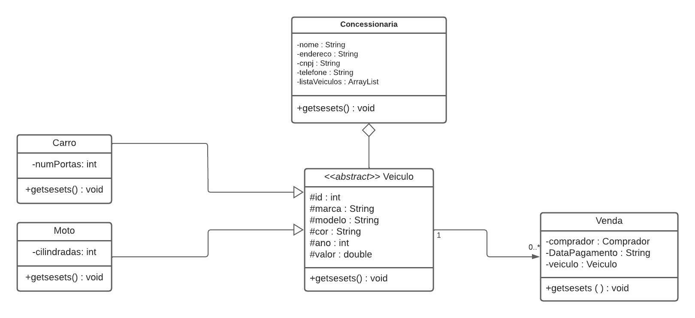
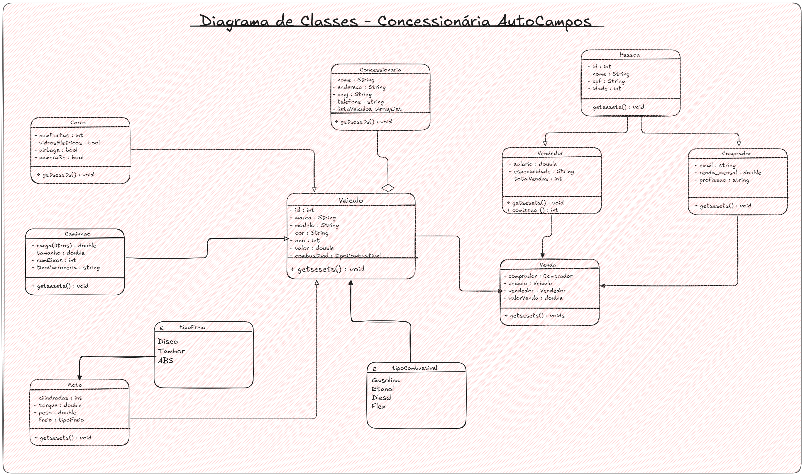

# Ponto de Controle 1

## Documentação:

### UML - Diagrama de Classes

Versão antiga:

Versão nova:

### Infraestrutura

- Docker Compose: [Docker Compose](../docker-compose.yml)
- Dockerfile: [Dockerfile](../Dockerfile)
- Hello World(framework): [Hello World](../main.py)

### Testes
